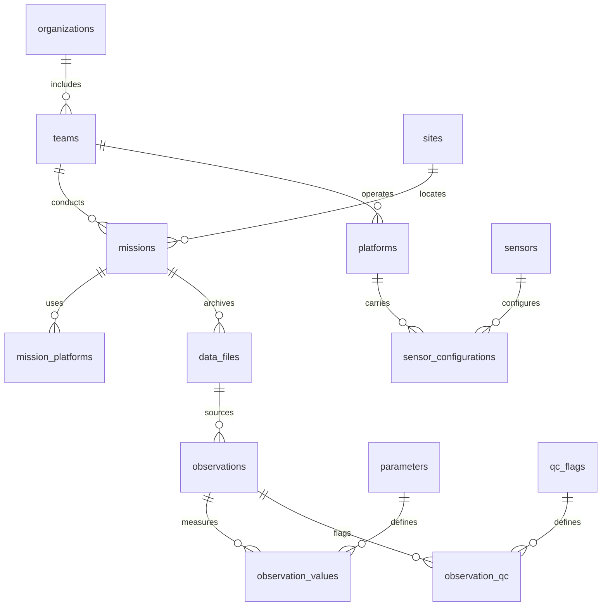

# Scientific schema and metadata setup

`data-api/migrations/001_scientific_data.sql` is the authoritative V1 schema.
IDs are UUIDs for metadata and bigint strings for observations. Times are
`timestamptz`, positions are nullable WGS84 `geometry(Point,4326)`. Spatial GiST
indexes cover geometry and its geography cast; mission/team/platform/time and MSL
altitude have B-tree indexes. Parameters have an indexed relational value table.



Mission institution is derived through its team/organization rather than copied
into each record. Mission platform types/names come from mission_platforms and
platforms, supporting multi-platform missions. Launch/study coordinates are on
the site's geometry. The mission also stores date, description, PI/faculty mentor,
notes, license, visibility, approval and a synthetic indicator.

Composite foreign keys enforce consistency across mission, team, platform,
sensor configuration, source file and observations. Sensor configuration JSON
stores instrument settings and can later hold versioned calibration references;
V1 does not implement automatic calibration correction or enforce configuration
validity intervals during import.

Each observation stores source record number, raw field strings and nullable
canonical fields. observation_values holds finite measurements by parameter ID;
observation_qc stores screening code/detail. A null position does not remove its
measurements. Approved public API results never expose per-row raw JSON or the
private R2 key. Duplicate source files within a mission are idempotent, enforced
by a unique checksum key. There is no blanket timestamp uniqueness constraint:
multiple sensors legitimately produce simultaneous observations.

## Creating the first import destination

Use a database administrator tool with bind parameters. The following transaction
is a **parameterized recipe**, not executable until you supply your actual metadata.
Capture IDs from each RETURNING clause for subsequent statements. Never substitute
untrusted strings by concatenation; use your driver's bound parameter API.

```sql
INSERT INTO organizations(name) VALUES (:institution) RETURNING id;
INSERT INTO teams(organization_id,name) VALUES (:organization_id,:team_name) RETURNING id;
INSERT INTO sites(team_id,name,location,description)
VALUES (:team_id,:site_name,ST_SetSRID(ST_MakePoint(:longitude,:latitude),4326),:site_description)
RETURNING id;
INSERT INTO platforms(team_id,type_id,name) VALUES (:team_id,:platform_type,:platform_name) RETURNING id;
INSERT INTO sensors(team_id,name,model,serial_number)
VALUES (:team_id,:sensor_name,:model,:serial_number) RETURNING id;
INSERT INTO sensor_configurations(sensor_id,team_id,platform_id,configuration)
VALUES (:sensor_id,:team_id,:platform_id,:configuration_json) RETURNING id;
INSERT INTO missions(team_id,site_id,name,mission_date,description,principal_investigator,notes,data_license,synthetic)
VALUES (:team_id,:site_id,:mission_name,:date,:description,:faculty_mentor,:notes,:license,:is_synthetic)
RETURNING id;
INSERT INTO mission_platforms(mission_id,platform_id,team_id) VALUES (:mission_id,:platform_id,:team_id);
```

Use an agreed data license and explicitly mark synthetic/test missions. New missions
are private/pending by default. The administrator upload destination selector now
lists the mission/platform/sensor combination. All files for that mission share its
publication policy; create a separate private mission for data that must stay private.

Use `npm run test:integration` only against a disposable database with PostGIS
available. It refuses to proceed when the scientific tables already exist, and it
does not drop a preexisting database. Production migration and test setup are separate.
